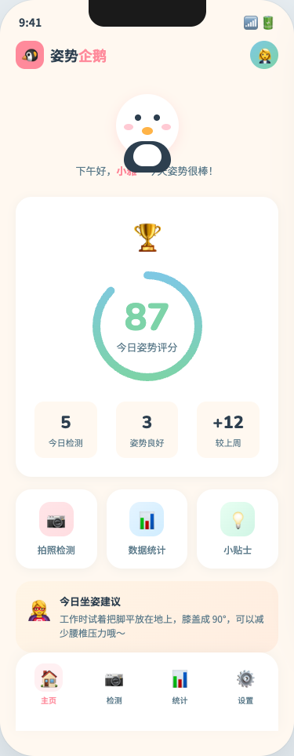
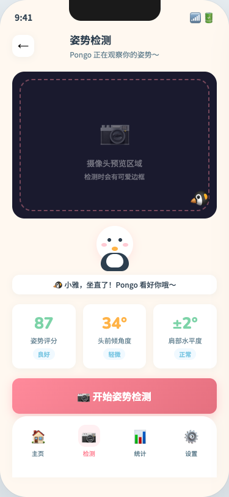
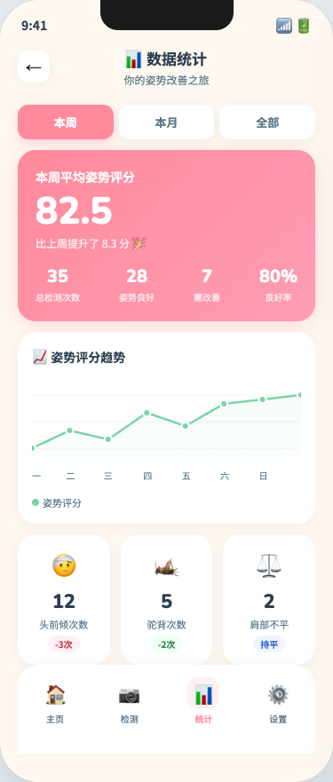
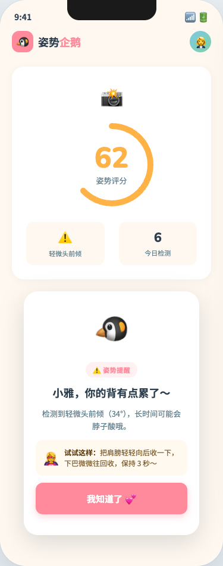

# Posture Penguin 🐧 姿势企鹅

**一个在浏览器里帮你盯坐姿的 Chrome 插件**：定时用摄像头检测你的坐姿，发现驼背、头前倾就派一只小企鹅来温柔提醒——所有画面都在你电脑本地处理，一张也不会上传。

[](LICENSE)

---

## 🖼 界面预览

> 以下为 UI 设计稿截图（来自 `design-assets/ui-mockups.html`），实际界面以扩展为准。

| 主页 · 姿势评分 | 检测 · 实时提醒 |
| :---: | :---: |
|  |  |
| **统计 · 趋势与报告** | **提醒 · 企鹅出场** |
|  |  |

---

## 🎯 为什么需要姿势企鹅？

长时间坐在电脑前，很容易不知不觉就头前倾、驼背、坐姿歪斜——等你发现时，脖子和腰已经酸了。

姿势企鹅的做法很直接：**定时拍一张照，本地 AI 判断坐姿，坐歪了就让小企鹅出来提醒你**。没有后台进程、没有账号、没有云端，关掉浏览器它就休息。

---

## ✨ 功能特性

| 功能 | 说明 |
| --- | --- |
| ⏰ **定时姿势检测** | 按你设定的间隔自动拍照，检测坐姿状态 |
| 🤖 **本地 AI 识别** | TensorFlow.js MoveNet（Lightning）推理，图像不离开你的电脑 |
| 🔔 **温柔提醒** | 小企鹅动画 + 柔和音效，提醒一次就走，不打断工作 |
| 📊 **数据统计** | 姿势评分趋势图、周报 / 月报 |
| 🖼 **打卡海报** | 一键生成带企鹅的坐姿打卡海报 |
| 🔒 **隐私保护** | 不上传任何图像或数据，记录只存在本地 Chrome Storage，90 天后自动清理 |

---

## 🛠 安装

> 姿势企鹅目前**尚未上架 Chrome Web Store**，请先从源码安装（约 5 分钟）。

### 普通用户：加载扩展

1. 克隆仓库并构建：

   ```bash
   git clone https://github.com/ouxxyy/postapp.git
   cd postapp/posture-penguin
   npm install
   npm run build
   ```

2. 打开 Chrome，访问 `chrome://extensions/`
3. 开启右上角的 **「开发者模式」**
4. 点击 **「加载已解压的扩展程序」**，选择 `posture-penguin/dist` 目录
5. 工具栏出现企鹅图标后，点开它，允许摄像头权限，设置检测间隔即可开始

### 开发者

```bash
cd posture-penguin
npm run dev         # 开发构建（watch 模式）
npm run type-check  # TypeScript 类型检查
npm run build       # 生产构建
```

---

## 🔒 隐私说明

- ✅ 所有图像处理均在**浏览器本地**完成（TensorFlow.js 本地推理）
- ✅ 不上传任何图像或视频数据，没有账号、没有统计埋点
- ✅ 姿势记录仅存储在本地 `chrome.storage`，90 天后自动清理（每天定时执行）
- ✅ 详细政策见 [posture-penguin/PRIVACY_POLICY.md](posture-penguin/PRIVACY_POLICY.md)（[English](posture-penguin/PRIVACY_POLICY_EN.md)）

---

## 📁 项目结构

```
postapp/
├── posture-penguin/     # Chrome 扩展（React 18 + TypeScript + Webpack 5，Manifest V3）
│   ├── src/             # 源代码：popup / background / content / offscreen / 核心算法
│   ├── dist/            # 构建产物（可直接加载到 Chrome）
│   └── PRIVACY_POLICY.md
├── design-assets/       # UI 设计稿与设计规范（README 预览图来自这里）
└── assets/              # 仓库公开素材
```

---

## 🧠 技术栈

| 技术 | 用途 |
| --- | --- |
| React 18 + TypeScript | 界面开发 |
| Webpack 5 | 构建打包 |
| TensorFlow.js MoveNet（Lightning） | 本地姿势识别 |
| Recharts | 数据可视化 |
| Chrome Extension Manifest V3 | 浏览器扩展平台 |

---

## 🐛 反馈

遇到问题提 [Issue](https://github.com/ouxxyy/postapp/issues) 时，附上 Chrome 版本、操作系统和报错截图就够了；**请不要上传含真人面部的截图**，普通界面截图即可。

---

## 👤 作者

作者全平台同名：**欧八同学**。

- 微信公众号：扫码关注
- 抖音：[搜索“欧八同学”](https://www.douyin.com/search/%E6%AC%A7%E5%85%AB%E5%90%8C%E5%AD%A6)
- 小红书：[搜索“欧八同学”](https://www.xiaohongshu.com/search_result?keyword=%E6%AC%A7%E5%85%AB%E5%90%8C%E5%AD%A6)
- X：[搜索“欧八同学”](https://x.com/search?q=%E6%AC%A7%E5%85%AB%E5%90%8C%E5%AD%A6&src=typed_query)

<p align="center">
  
</p>

如果这个项目对你有用，欢迎点个 Star 🐧

---

## 📄 开源协议

[MIT License](LICENSE) —— 欢迎 fork、提交 PR。

---

**姿势企鹅** —— 用温柔的方式，让你慢慢变好 🐧
